# 使用状态机的方式实现booth乘法器

[toc]

## Booth乘法器前端设计

### Booth乘法器原理

课堂上讲解的Booth乘法器原理如图

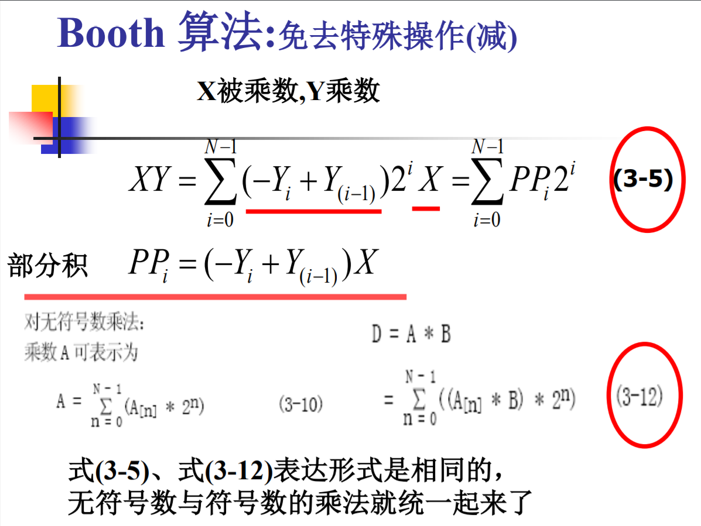

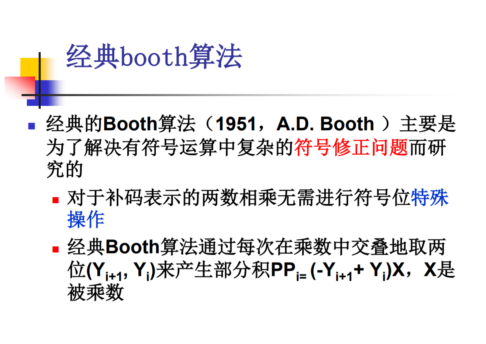

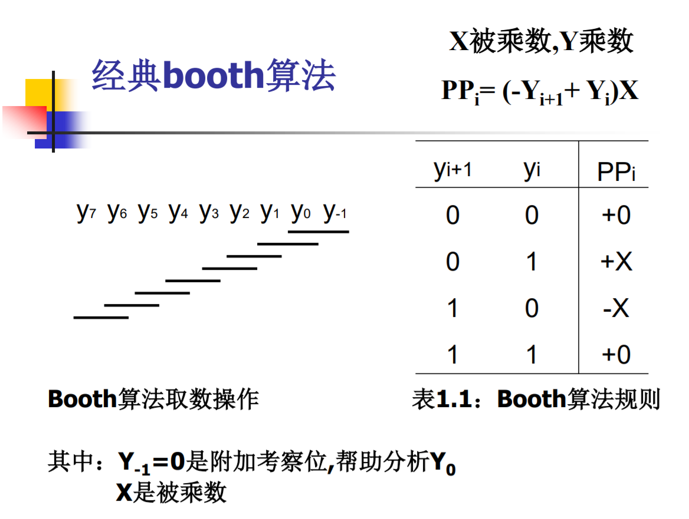

### Booth乘法器设计思路

Booth乘法器不会加快计算速度，只是单纯解决了有符号运算中复杂的符号修正问题，所以需要进行32次乘加操作。而这32次乘加操作我们可以在一个周期内完成，但这样会造成**关键路径延时过高**；我们也可以分成数级流水线，通过流水线的方式打断关键路径，但是可能会**面积和功耗升高，达不到要求**；所以我们选择使用**状态机**的方式完成Booth乘法器的设计，虽然会降低功耗和面积，也不会有很长时间的关键路径，但是**会有很长的输入输出延时**，但是Spec中并没有对此做出要求，所以我们认为这是一个不重要的参数，**无论输入输出延时多长都可以接受**。如下图：

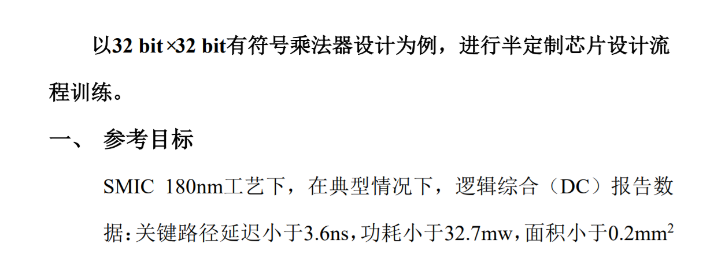

### Booth乘法器状态机

通过Booth算法原理，我们发现ooth算法完成一项部分积的计算需要一次加法和移位操作（移位操作指乘2），如果要完成整个乘法计算，我们需要进行32次加法和移位。

状态机图片如下

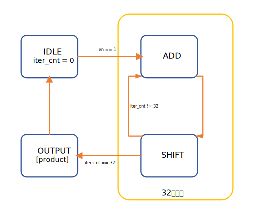

所以我们的Booth乘法器的Top模块应当如下图
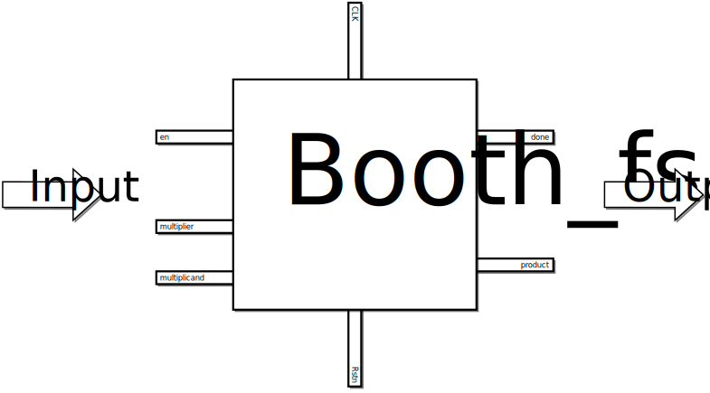

### Booth乘法器部分积生成
在状态机的IDLE阶段生成部分积，分别保存在`a_reg`和`s_reg`。`a_reg`保存正的部分积，相当于做了加法；`s_reg`保存负的部分积，相当于做了减法。两个寄存器的宽度为66位，我们将部分积保存在高位，部分积压缩后，进行右移，最终可以发现我们进行的部分积为最低位的部分积。

```verilog
……
reg  [2*DATAWIDTH+1:0]  a_reg,s_reg,p_reg,sum_reg;  // computational values.
……
assign multiplier_neg = -{multiplier[DATAWIDTH-1],multiplier};
//取补码，相当于每一位取反，然后加1 
……
always @(posedge clk or negedge rstn) begin
……
  case (current_state)
    IDLE :  begin
      a_reg    <= {multiplier[DATAWIDTH-1],multiplier,{(DATAWIDTH+1){1'b0}}};
      s_reg    <= {multiplier_neg,{(DATAWIDTH+1){1'b0}}};
      p_reg    <= {{(DATAWIDTH+1){1'b0}},multiplicand,1'b0};
      iter_cnt <= 0;
      done     <= 1'b0;
    end
  endcase
……
end
……
```

### Booth乘法器部分积压缩

因为我们采用状态机方式设计，所以，每个状态机循环进行一次部分积压缩，即使用加法器对其应用加法，并将结果进行移位。因为我们将部分积保存在了高位，所以每次压缩完对结果右移；这样做，相当于将部分积保存在低位，每次压缩完，将部分积寄存器左移。

```verilog
……
adder_66 adder1(
  .A(data_in1),
  .B(data_in2),
  .S(sum),
  .c66()
);
……
assign data_in1 =     p_reg;
assign data_in2 =    (p_reg[1:0]==2'b01) ? a_reg:// + multiplier
                     (p_reg[1:0]==2'b10) ? s_reg:// - multiplier
                                               0;// nop

// algorithm implemenation details.
always @(posedge clk or negedge rstn) begin
……
  case (current_state)
    IDLE :  begin
……
    end
    ADD  :  begin
      sum_reg <= sum;
      iter_cnt <= iter_cnt + 1;
    end
    SHIFT :  begin
      p_reg <= {sum_reg[2*DATAWIDTH+1],sum_reg[2*DATAWIDTH+1:1]}; // right shift 
    end
    OUTPUT : begin
      product <= p_reg[2*DATAWIDTH:1];
      done <= 1'b1;
    end
  endcase
 end
end
```

另外，我们的加法器为66位加法器，我们66位加法器的实现方式是将64位超前进位加法器和两个1bit全加器级联而成，下面是我们64bit超前进位加法器的设计。

#### 64位超前进位加法器设计
64位超前进位加法器由4位超前进位加法器级联而成。

4位超前进位加法器电路图如下
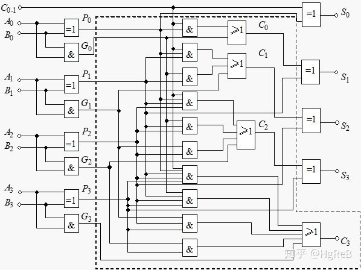

代码如下

```verilog
//一位全加器
module adder(X,Y,Cin,F,Cout);

    input X,Y,Cin;
    output F,Cout;
  
    assign F = X ^ Y ^ Cin;
    assign Cout = (X ^ Y) & Cin | X & Y;
endmodule 

///四位CLA部件
module CLA(c0,c1,c2,c3,c4,p1,p2,p3,p4,g1,g2,g3,g4);
   
    input c0,g1,g2,g3,g4,p1,p2,p3,p4;
    output c1,c2,c3,c4;
	 
    assign  c1 = g1 ^ (p1 & c0),
            c2 = g2 ^ (p2 & g1) ^ (p2 & p1 & c0),
            c3 = g3 ^ (p3 & g2) ^ (p3 & p2 & g1) ^ (p3 & p2 & p1 & c0),
            c4 = g4 ^ (p4 & g3) ^ (p4 & p3 & g2) ^ (p4 & p3 & p2 & g1) 
              ^ (p4 & p3 & p2 & p1 & c0);
	 
endmodule 
//四位超前进位加法器
module adder_4(x,y,c0,c4,F,Gm,Pm);
    input [4:1] x;
    input [4:1] y;
    input c0;
    output c4,Gm,Pm;
    output [4:1] F;
	  	  
    wire p1,p2,p3,p4,g1,g2,g3,g4;
    wire c1,c2,c3;
    adder adder1(
        .X(x[1]),
        .Y(y[1]),
        .Cin(c0),
        .F(F[1]),
        .Cout()
    );
		
    adder adder2(
        .X(x[2]),
        .Y(y[2]),
        .Cin(c1),
        .F(F[2]),
        .Cout()
    );	
		
    adder adder3(
        .X(x[3]),
        .Y(y[3]),
        .Cin(c2),
        .F(F[3]),
        .Cout()
    );
			
    adder adder4(
        .X(x[4]),
        .Y(y[4]),
        .Cin(c3),
        .F(F[4]),
        .Cout()
    );		
		
    CLA CLA(
        .c0(c0),
        .c1(c1),
        .c2(c2),
        .c3(c3),
        .c4(c4),
        .p1(p1),
        .p2(p2),
        .p3(p3),
        .p4(p4),
        .g1(g1),
        .g2(g2),
        .g3(g3),
        .g4(g4)
    );
				
		
	  
    assign  p1 = x[1] ^ y[1],	  
            p2 = x[2] ^ y[2],
            p3 = x[3] ^ y[3],
            p4 = x[4] ^ y[4];

    assign  g1 = x[1] & y[1],
            g2 = x[2] & y[2],
            g3 = x[3] & y[3],
            g4 = x[4] & y[4];

    assign  Pm = p1 & p2 & p3 & p4,
            Gm = g4 ^ (p4 & g3) ^ (p4 & p3 & g2) ^ (p4 & p3 & p2 & g1);

endmodule 

```

通过复用CLA电路可以级联完成16位超前进位加法器，如图
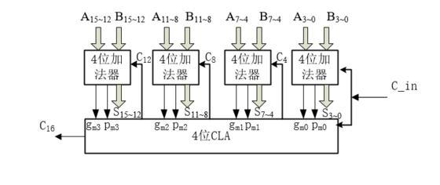
代码如下

```verilog
//16位加法器
module adder_16(A,B,c0,c16,S,px,gx);
    input [16:1] A;
    input [16:1] B;
    input c0;
    output c16,gx,px;
    output [16:1] S;
	
    wire c4,c8,c12;
    wire Pm1,Gm1,Pm2,Gm2,Pm3,Gm3,Pm4,Gm4;
		
    adder_4 adder1(
        .x(A[4:1]),
        .y(B[4:1]),
        .c0(c0),
        .c4(),
        .F(S[4:1]),
        .Gm(Gm1),
        .Pm(Pm1)
    );
	
    adder_4 adder2(
        .x(A[8:5]),
        .y(B[8:5]),
        .c0(c4),
        .c4(),
        .F(S[8:5]),
        .Gm(Gm2),
        .Pm(Pm2)
    );
	
    adder_4 adder3(
        .x(A[12:9]),
        .y(B[12:9]),
        .c0(c8),
        .c4(),
        .F(S[12:9]),
        .Gm(Gm3),
        .Pm(Pm3)
    );

    adder_4 adder4(
        .x(A[16:13]),
        .y(B[16:13]),
        .c0(c12),
        .c4(),
        .F(S[16:13]),
        .Gm(Gm4),
        .Pm(Pm4)
    );
	

    CLA CLA(
        .c0(c0),
        .c1(c4),
        .c2(c8),
        .c3(c12),
        .c4(c16),
        .p1(Pm1),
        .p2(Pm2),
        .p3(Pm3),
        .p4(Pm4),
        .g1(Gm1),
        .g2(Gm2),
        .g3(Gm3),
        .g4(Gm4)
    );

    assign  px = Pm1 & Pm2 & Pm3 & Pm4,
            gx = Gm4 ^ (Pm4 & Gm3) ^ (Pm4 & Pm3 & Gm2) ^ (Pm4 & Pm3 & Pm2 & Gm1);
	       
endmodule 

```

最终16位加法器级联完成64位超前进位加法器。代码如下

```verilog
//64位并行进位加法器顶层模块
module adder_64(A,B,c0,c64,S,px,gx);
    input [64:1] A;
    input [64:1] B;
    input c0;
    output [64:1] S;
    output c64,px,gx;
	 
    wire px1,gx1,px2,gx2,px3,gx3,px4,gx4;
    wire c16,c32,c48,c64;

    adder_16 adder1(
        .A(A[16:1]),
        .B(B[16:1]),
        .c0(c0),
        .c16(),
        .S(S[16:1]),
        .px(px1),
        .gx(gx1)
    );
  
    adder_16 adder2(
        .A(A[32:17]),
        .B(B[32:17]),
        .c0(c16),
        .c16(),
        .S(S[32:17]),
        .px(px2),
        .gx(gx2)
    );

    adder_16 adder3(
        .A(A[48:33]),
        .B(B[48:33]),
        .c0(c32),
        .c16(),
        .S(S[48:33]),
        .px(px3),
        .gx(gx3)
    );
  
    adder_16 adder4(
        .A(A[64:49]),
        .B(B[64:49]),
        .c0(c48),
        .c16(),
        .S(S[64:49]),
        .px(px4),
        .gx(gx4)
    );

    CLA CLA(
        .c0(c0),
        .c1(c16),
        .c2(c32),
        .c3(c48),
        .c4(c64),
        .p1(px1),
        .p2(px2),
        .p3(px3),
        .p4(px4),
        .g1(gx1),
        .g2(gx2),
        .g3(gx3),
        .g4(gx4)
    );

 
    assign  px = px1 & px2 & px3 & px4,
            gx = gx4 ^ (px4 & gx3) ^ (px4 & px3 & gx2) ^ (px4 & px3 & px2 & gx1);

endmodule 
```

### Booth乘法器前仿验证

乘法器验证我们分为前仿、和后仿两部分。在前仿和后仿我们均使用自动化的验证脚本。前仿我们在windows平台，使用modelsim完成。

testbench分为两部分，分别为66位加法器的testbench，和booth乘法器的testbench。

无论是加法器的testbench，还是乘法器的testbench，我们均选择随机生成`16'bFFFF`，即`65535`组操作数，并作为激励输入，并自动验证结果是否正确

加法器testbench如下

```verilog
`timescale 1ns/1ps

// Basic exhaustive self checking test bench.
`define TEST_WIDTH 66
module adder_tb;

reg clk;
reg rstn;
integer src1;
integer src2;
reg [`TEST_WIDTH-1:0] A;
reg [`TEST_WIDTH-1:0] B;


//输入 ：要定义有符号和符号，输出：无要求
wire signed [`TEST_WIDTH-1:0]               data_out;
wire signed [`TEST_WIDTH-1:0]               data_in1;
wire signed [`TEST_WIDTH-1:0]               data_in2;

reg  signed [`TEST_WIDTH-1:0]               adder_ref;
reg  signed [`TEST_WIDTH-1:0]                      data_out_reg;
assign data_in1 = A[`TEST_WIDTH-1:0];
assign data_in2 = B[`TEST_WIDTH-1:0];

adder_66 adder 
(
    .A(data_in1),                            
    .B(data_in2),
    .S(data_out),
    .c66()
);

always #1 clk = ~clk;

integer num_good;
integer i,j;
initial begin
    clk = 1;
    rstn = 1;

    #2 rstn = 0; #2 rstn = 1;
  
    num_good = 0;


    for(i = 0; i < 32'hFFFF;i=i+1) begin

        A={$random}%(66'h3_FFFF_FFFF_FFFF_FFFF);//
        B={$random}%(66'h3_FFFF_FFFF_FFFF_FFFF);//
        if (data_out_reg !== adder_ref) 
            $display("A = %d B = %d data_out =%d adder_ref =%d",data_in1,data_in2,data_out_reg,adder_ref);
        else
            num_good = num_good + 1;
        @(posedge clk);
  end		

    $display("sim done. num good = %d",num_good);
    $finish;

end

always @(posedge clk or negedge rstn) begin
    adder_ref       <=  data_in1+data_in2;
    data_out_reg   <=  data_out;
end

initial begin
    // $fsdbDumpvars();
    // $fsdbDumpMDA();
    // $dumpvars();
    // if(finish === 1)
    //     $finish;
end
endmodule
```
加法器仿真结果如下
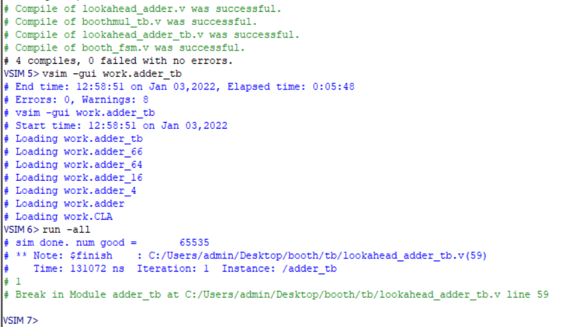


乘法器testbench如下

```verilog
`timescale 1ns/1ps

// Basic exhaustive self checking test bench.
`define TEST_WIDTH 32
module booth_fsm_tb;

reg clk;
reg rstn;
reg en;
integer multiplier1;
integer multiplicand1;
reg [`TEST_WIDTH-1:0] multiplier;
reg [`TEST_WIDTH-1:0] multiplicand;
wire    done;
reg     finish;

//输入 ：要定义有符号和符号，输出：无要求
wire signed [2*`TEST_WIDTH-1:0] product;
wire signed [`TEST_WIDTH-1:0]                m1_in;
wire signed [`TEST_WIDTH-1:0]                m2_in;

reg  signed [2*`TEST_WIDTH-1:0] product_ref;
reg  [2*`TEST_WIDTH-1:0] product_ref_u;
assign m1_in = multiplier[`TEST_WIDTH-1:0];
assign m2_in = multiplicand[`TEST_WIDTH-1:0];

booth_fsm #(.DATAWIDTH(`TEST_WIDTH)) booth 
(
    .clk(clk),
    .rstn(rstn),
    .en(en),
    .multiplier(multiplier),                            
    .multiplicand(multiplicand),
    .done(done),
    .product(product)
 );

always #1 clk = ~clk;

integer num_good;
integer i,j;
initial begin
    clk = 1;
    en = 0;
    rstn = 1;
    finish = 0;
    #2 rstn = 0; #2 rstn = 1;
  
    num_good = 0;
    multiplier=0;
    multiplicand=0;
    #9;

    for(i = 0; i < 32'hFFFF;i=i+1) begin
          
      
        en = 1;

        wait (done == 0);
        wait (done == 1);
        multiplier={$random}%(32'hFFFF_FFFF);
        multiplicand={$random}%(32'hFFFF_FFFF);
        if (product_ref !== product) 
            $display("multiplier = %d multiplicand = %d proudct =%d product_ref =%d",m1_in,m2_in,product,product_ref);
        else
            num_good = num_good + 1;
        @(posedge clk);
  end		
  finish = 1;
  $display("sim done. num good = %d",num_good);
  $finish;

end

always @(posedge clk or negedge rstn) begin
    product_ref<=m1_in*m2_in;
    product_ref_u<=m1_in*m2_in;
end

initial begin
    // $fsdbDumpvars();
    // $fsdbDumpMDA();
    // $dumpvars();
    // if(finish === 1)
    //     $finish;
end
endmodule
```

乘法器仿真结果如下：
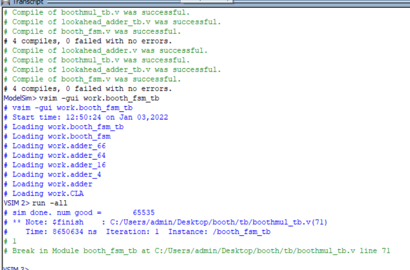

## Booth乘法器后端设计

本章节采用`SMIC180`纳米工艺库，对Booth乘法器进行版图综合设计，。整个流程大致如下：首先使用 Design Compiler 对所编写的 Verilog 文件进行逻辑综合，并添加相应约束。之后对输出的网表文件进行时序验证和形式验证。接着用 ICC 进行版图综合，并进行 LVS/DRC检查。最后进行后仿，验证设计是否符合要求。

### DC综合


#### 指定工艺库
在进行DC综合时，需要先进行工艺库的指定，这里指定`smic180`typical工艺库，工作电压为1.0V。所用的tcl命令如下：

```tcl
##########################################################################################
# Library Setup Variables
##########################################################################################

# For the following variables, use a blank space to separate multiple entries.
# Example: set TARGET_LIBRARY_FILES "lib1.db lib2.db lib3.db"
#  Additional search path to be added to the default search path
set ADDITIONAL_SEARCH_PATH         "/home/IC/smic180/digital/sc/synopsys \
                   	            /home/IC/smic180/digital/io/synopsys " ;          

#  Target technology logical libraries
set TARGET_LIBRARY_FILES           "typical.db ";   

#  Extra link logical libraries not included in TARGET_LIBRARY_FILES
set ADDITIONAL_LINK_LIB_FILES      "SP018N_V1p0_typ.db ";   

#  List of max min library pairs "max1 min1 max2 min2 max3 min3"...
set MIN_LIBRARY_FILES              "slow.db                    fast.db                        \
                                    SP018N_V1p0_min.db         SP018N_V1p0_max.db         ";   

puts "RM-Info: Completed script [info script]\n"

```

#### 制定约束条件

在进行逻辑综合时，选择约束条件如下：
> 预计达到的时钟频率为 200 MHz。采用 create_clock 对寄存器间的时钟频率进行约束。
> 对 clock_latency，clock_uncertainty，clock_transition 按照经验值进行设定。
> 将输入延时和输出延时按照经验值设定。
> 其他约束

约束代码如下

```tcl
#*******************************************************************
#set design optimization constraints
#*******************************************************************
create_clock -name clock_main -period 5 [get_ports "clk"]

set_clock_latency      0.05 [get_clocks "clock_main"]
set_clock_uncertainty  1.5 -setup [get_clocks "clock_main"]
set_clock_uncertainty  0.05 -hold [get_clocks "clock_main"]
set_clock_transition   0.05 [get_clocks "clock_main"]


#clock_main 
set_input_delay  -max 1 	-clock clock_main [remove_from_collection [all_inputs] [get_ports  "clk"]]
set_input_delay  -min 0.1 	-clock clock_main [remove_from_collection [all_inputs] [get_ports  "clk"]]
set_output_delay -max 1 	-clock clock_main [all_outputs]
set_output_delay -min 0.1 	-clock clock_main [all_outputs]


#*******************************************************************
#set design rule constraints
#*******************************************************************

set_ideal_network [get_ports "rstn"]
set_ideal_network [get_ports "clk"]

#set_driving_cell -lib_cell "PSBI8N"  -from_pin "A" -pin "P" [all_inputs]

group_path -name REGOUT      -to   [all_outputs] 
group_path -name REGIN       -from [remove_from_collection [all_inputs] [get_ports "clk"]] 
group_path -name FEEDTHROUGH -from [remove_from_collection [all_inputs] [get_ports "clk"]] -to [all_outputs]
```

#### 综合以及结果写出

逻辑综合部分完成会写出网表文件，sdc约束文件，时序报告，面积报告，功耗报告以及violation报告。

各报告详细信息如下

##### Violation
无violation

报告如下：

```txt
 
****************************************
Report : constraint
        -all_violators
        -verbose
Design : booth_fsm
Version: K-2015.06
Date   : Mon Jan  3 14:29:51 2022
****************************************

1
```

##### Power

总功耗为`4.1157mW`，以动态功耗为主，大多数功耗为寄存器的Internal Power。符合功耗要求不高于`32.7mW`。

报告如下。

```txt

****************************************
Report : power
        -analysis_effort low
        -verbose
Design : booth_fsm
Version: K-2015.06
Date   : Mon Jan  3 14:29:51 2022
****************************************


Library(s) Used:

    typical (File: /home/IC/smic180/digital/sc/synopsys/typical.db)


Operating Conditions: typical   Library: typical
Wire Load Model Mode: top


Global Operating Voltage = 1.8  
Power-specific unit information :
    Voltage Units = 1V
    Capacitance Units = 1.000000pf
    Time Units = 1ns
    Dynamic Power Units = 1mW    (derived from V,C,T units)
    Leakage Power Units = 1pW


  Cell Internal Power  =   3.7915 mW   (92%)
  Net Switching Power  = 324.1418 uW    (8%)
                         ---------
Total Dynamic Power    =   4.1156 mW  (100%)

Cell Leakage Power     = 101.9960 nW

                 Internal         Switching           Leakage            Total                         Cell
Power Group      Power            Power               Power              Power   (   %    )  Attrs  Count
---------------------------------------------------------------------------------------------------------
io_pad             0.0000            0.0000            0.0000            0.0000  (   0.00%)            0
memory             0.0000            0.0000            0.0000            0.0000  (   0.00%)            0
black_box          0.0000            0.0000            0.0000            0.0000  (   0.00%)            0
clock_network      0.0000            0.0000            0.0000            0.0000  (   0.00%)            0
register           3.5466        6.8441e-02        5.8482e+04            3.6151  (  87.84%)            295
sequential         0.0000            0.0000            0.0000            0.0000  (   0.00%)            0
combinational      0.2449            0.2557        4.3514e+04            0.5006  (  12.16%)            902
---------------------------------------------------------------------------------------------------------
Total              3.7915 mW         0.3241 mW     1.0200e+05 pW         4.1157 mW

1
```

##### Area

因为使用状态机电路，面积远远低于要求，面积为`0.0186mm2`，符合要求，不高于`0.2mm2`，报告如下：

```txt
 
****************************************
Report : area
Design : booth_fsm
Version: K-2015.06
Date   : Mon Jan  3 14:29:51 2022
****************************************

Library(s) Used:

    typical (File: /home/IC/smic180/digital/sc/synopsys/typical.db)

Number of ports:                          297
Number of nets:                          1429
Number of cells:                         1200
Number of combinational cells:            902
Number of sequential cells:               296
Number of macros/black boxes:               0
Number of buf/inv:                        120
Number of references:                      43

Combinational area:              13448.635328
Buf/Inv area:                      804.988811
Noncombinational area:           18644.471741
Macro/Black Box area:                0.000000
Net Interconnect area:      undefined  (No wire load specified)

Total cell area:                 32093.107069
Total area:                 undefined

Hierarchical area distribution
------------------------------

                                  Global cell area            Local cell area
                                  -------------------  ------------------------------ 
Hierarchical cell                 Absolute    Percent  Combi-      Noncombi-   Black-
                                  Total       Total    national    national    boxes   Design
--------------------------------  ----------  -------  ----------  ----------  ------  -----------------------
booth_fsm                         32093.1071    100.0  10491.4657  18644.4717  0.0000  booth_fsm
add_x_4                            1410.3936      4.4   1410.3936      0.0000  0.0000  booth_fsm_DW01_inc_J3_0
sub_x_2                            1546.7760      4.8   1546.7760      0.0000  0.0000  booth_fsm_DW01_sub_0
--------------------------------  ----------  -------  ----------  ----------  ------  -----------------------
Total                                                  13448.6353  18644.4717  0.0000

1
```

##### Timing

关键路径延时为`3.36ns`，低于要求的`3.6ns`，经过检查发现，关键路径为66bits加法器，符合预期。报告如下：

```txt
 
****************************************
Report : timing
        -path full
        -delay max
        -nets
        -max_paths 1
        -transition_time
Design : booth_fsm
Version: K-2015.06
Date   : Mon Jan  3 14:29:51 2022
****************************************

Operating Conditions: typical   Library: typical
Wire Load Model Mode: top


  Startpoint: p_reg_reg_1_
              (rising edge-triggered flip-flop clocked by clock_main)
  Endpoint: sum_reg_reg_65_
            (rising edge-triggered flip-flop clocked by clock_main)
  Path Group: clock_main
  Path Type: max

Attributes:
    d - dont_touch
    u - dont_use
   mo - map_only
   so - size_only
    i - ideal_net or ideal_network
  inf - infeasible path

  Point                        Fanout     Trans      Incr       Path      Attributes
  ------------------------------------------------------------------------------------------
  clock clock_main (rise edge)                       0.00       0.00
  clock network delay (ideal)                        0.05       0.05
  p_reg_reg_1_/CK (DFFSX1)                 0.05      0.00       0.05 r    i 
  p_reg_reg_1_/Q (DFFSX1)                  0.18      0.42       0.47 r
  n1125 (net)                    2                   0.00       0.47 r
  U1272/Y (NOR2X4)                         0.10      0.07       0.55 f
  n791 (net)                    16                   0.00       0.55 f
  U1280/Y (NAND2XL)                        0.07      0.06       0.61 r
  n736 (net)                     1                   0.00       0.61 r
  U1281/Y (NAND2XL)                        0.07      0.06       0.67 f
  n1011 (net)                    2                   0.00       0.67 f
  U1282/Y (NAND2XL)                        0.16      0.11       0.78 r
  n1010 (net)                    4                   0.00       0.78 r
  U1283/Y (NAND2XL)                        0.06      0.05       0.82 f
  n740 (net)                     1                   0.00       0.82 f
  U805/Y (AOI2BB2XL)                       0.28      0.18       1.01 r
  n939 (net)                     3                   0.00       1.01 r
  U1287/Y (INVXL)                          0.07      0.04       1.05 f
  n742 (net)                     1                   0.00       1.05 f
  U1290/Y (OAI21XL)                        0.24      0.17       1.22 r
  n935 (net)                     3                   0.00       1.22 r
  U1294/Y (NAND2XL)                        0.07      0.05       1.27 f
  n752 (net)                     1                   0.00       1.27 f
  U806/Y (AOI21XL)                         0.22      0.15       1.42 r
  n1053 (net)                    2                   0.00       1.42 r
  U810/Y (AOI2BB2XL)                       0.24      0.17       1.59 r
  n958 (net)                     2                   0.00       1.59 r
  U718/Y (NAND2X1)                         0.09      0.06       1.65 f
  n951 (net)                     2                   0.00       1.65 f
  U717/Y (AOI22X1)                         0.24      0.15       1.80 r
  n962 (net)                     3                   0.00       1.80 r
  U753/Y (INVXL)                           0.07      0.04       1.85 f
  n782 (net)                     1                   0.00       1.85 f
  U1310/Y (OAI21X1)                        0.21      0.15       2.00 r
  n930 (net)                     2                   0.00       2.00 r
  U727/Y (NOR2X2)                          0.07      0.05       2.05 f
  n929 (net)                     3                   0.00       2.05 f
  U820/Y (AOI21X1)                         0.15      0.11       2.16 r
  n917 (net)                     2                   0.00       2.16 r
  U1257/Y (NOR2X1)                         0.09      0.06       2.22 f
  n916 (net)                     3                   0.00       2.22 f
  U748/Y (NOR2X1)                          0.13      0.10       2.32 r
  n908 (net)                     2                   0.00       2.32 r
  U1316/Y (OR4X2)                          0.05      0.10       2.42 r
  n808 (net)                     1                   0.00       2.42 r
  U824/Y (AOI21X1)                         0.11      0.07       2.49 f
  n965 (net)                     3                   0.00       2.49 f
  U843/Y (AOI31XL)                         0.15      0.11       2.60 r
  n842 (net)                     1                   0.00       2.60 r
  U842/Y (OAI22XL)                         0.13      0.10       2.69 f
  n896 (net)                     3                   0.00       2.69 f
  U902/Y (NOR4BXL)                         0.10      0.14       2.84 f
  n849 (net)                     1                   0.00       2.84 f
  U900/Y (AOI211XL)                        0.31      0.20       3.03 r
  n865 (net)                     3                   0.00       3.03 r
  U851/Y (NOR2XL)                          0.10      0.07       3.11 f
  n870 (net)                     2                   0.00       3.11 f
  U864/Y (NOR2XL)                          0.15      0.11       3.22 r
  n878 (net)                     2                   0.00       3.22 r
  U879/Y (INVXL)                           0.05      0.04       3.25 f
  n881 (net)                     1                   0.00       3.25 f
  U912/Y (NAND4XL)                         0.18      0.07       3.32 r
  n885 (net)                     1                   0.00       3.32 r
  U909/Y (NAND4XL)                         0.09      0.07       3.39 f
  n647 (net)                     1                   0.00       3.39 f
  sum_reg_reg_65_/D (DFFSX1)               0.09      0.00       3.39 f
  data arrival time                                             3.39

  clock clock_main (rise edge)                       5.00       5.00
  clock network delay (ideal)                        0.05       5.05
  clock uncertainty                                 -1.50       3.55
  sum_reg_reg_65_/CK (DFFSX1)                        0.00       3.55 r
  library setup time                                -0.16       3.39
  data required time                                            3.39
  ------------------------------------------------------------------------------------------
  data required time                                            3.39
  data arrival time                                            -3.39
  ------------------------------------------------------------------------------------------
  slack (MET)                                                   0.00

1
```

##### 总结

通过分析报告发现，因为采用了状态机的方式完成本设计，面积功耗远低于预期，为预期的`10%`左右，另外关键路径为加法器结果的最高（需要进位传递）符合预期，另外，因为我们设定了很高的时钟不确定度，导致裕度为0，但其实关键路径延时达到了Spec设定的要求。

### ICC版图设计

进行了DC的逻辑综合之后，我们要开始版图设计，版图设计工具为ICC。在使用ICC时，需要将DC生成的网表文件和SDC约束文件进行导入。

#### 工艺库选定

在进行 DC 综合时，已经对工艺库进行了选定，在进行 ICC 设计时同样选择SMIC180的typical工艺库。

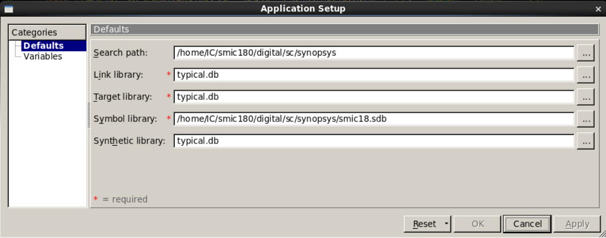

#### ICC初始化

初始化部分代码如下所示，读入设计文件和sdc文件，并初始化

```tcl
create_mw_lib  -technology /home/IC/smic180/digital/sc/apollo/tf/smic18_6lm.tf -mw_reference_library \
                {/home/IC/smic180/digital/sc/apollo/smic18} -bus_naming_style {[%d]}  -open  booth_fsm
import_designs -format verilog -top booth_fsm -cel booth_fsm {/home/IC/boothworkspace/1DC-RM/icc3/booth_fsm.mapped.v}
uniquify_fp_mw_cel
current_design booth_fsm
link
set_tlu_plus_files  -max_tluplus /home/IC/smic180/itf_tluplus/smiclog018_6lm_cell_max.tluplus \
                    -min_tluplus /home/IC/smic180/itf_tluplus/smiclog018_6lm_cell_min.tluplus \
                    -tech2itf_map  /home/IC/smic180/itf_tluplus/6lm.map
read_sdc  -version Latest "/home/IC/boothworkspace/1DC-RM/icc3/booth_fsm.mapped.sdc"

```

初始化完成如下图所示：

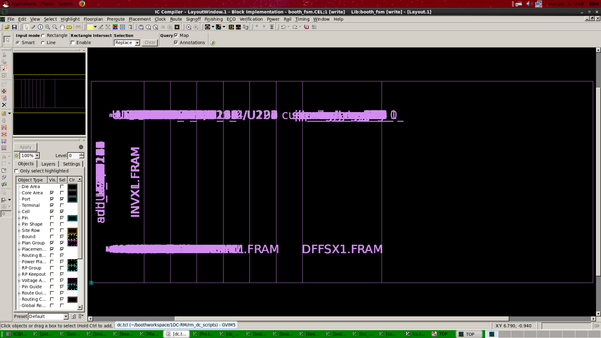

#### 电源网络

接下来开始电源网络的搭建

电源网络搭建的命令如下

```tcl
derive_pg_connection -power_net {VDD} -ground_net {VSS} -power_pin {VDD} -ground_pin {VSS}
derive_pg_connection -power_net {VDD} -ground_net {VSS} -tie
create_rectangular_rings  -nets  {VDD VSS}  -left_segment_layer METAL6 \
                                            -left_segment_width 4.5 \
                                            -right_segment_layer METAL6 \
                                            -right_segment_width 4.5 \
                                            -bottom_offset 17 \
                                            -bottom_segment_width 4.5 -top_offset 17 \
                                            -top_segment_width 4.5 \
                                            -offsets absolute
preroute_standard_cells -nets  {VDD VSS}    -connect horizontal  \
                                            -fill_empty_rows  \
                                            -port_filter_mode off \
                                            -cell_master_filter_mode off \
                                            -cell_instance_filter_mode off \
                                            -voltage_area_filter_mode off \
                                            -route_type {P/G Std. Cell Pin Conn}
verify_pg_nets  -std_cell_pin_connection ignore -macro_pin_connection all -pad_pin_connection all
```

搭建好电源网络如下图所示

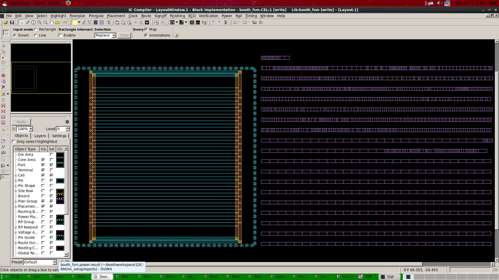

#### 时钟树

接下来构建时钟树，并对原件进行布局

时钟树构建命令如下

```tcl
set_ideal_network [all_fanout -flat -clock_tree]
create_placement -congestion -timing_driven
place_opt -effort high -congestion
remove_routing_rules -all
define_routing_rule  -default_reference_rule  -multiplier_width 2  -multiplier_spacing 2  {clk_dsdw}
set_clock_tree_options  -clock_tree clock_main -routing_rule clk_dsdw  \
                        -use_default_routing_for_sinks 1 -layer_list_for_sinks {METAL3 METAL4 METAL5 METAL6} \
                        -use_leaf_routing_rule_for_sinks 1 -max_transition 0.500 -leaf_max_transition -1.000 \
                        -use_leaf_max_transition_on_exceptions FALSE -use_leaf_max_transition_on_macros FALSE \
                        -max_capacitance 0.600 -max_fanout 2000 -max_rc_scale_factor 0.000 \
                        -target_early_delay 0.000 -target_skew 0.000 -buffer_relocation TRUE \
                        -gate_sizing FALSE -buffer_sizing TRUE -gate_relocation TRUE \
                        -layer_list {METAL3 METAL4 METAL5 METAL6}
set_clock_tree_references   -references {typical/CLKBUFX1 typical/CLKINVXL typical/CLKINVX8 typical/CLKINVX4 \
                                         typical/CLKINVX3 typical/CLKINVX20 typical/CLKINVX2 typical/CLKINVX16 \
                                         typical/CLKBUFX12 typical/CLKINVX12 typical/CLKBUFXL typical/CLKBUFX8 \
                                         typical/CLKBUFX4 typical/CLKBUFX3 typical/CLKBUFX20 typical/CLKBUFX2 \
                                         typical/CLKBUFX16 typical/CLKINVX1 } -clock_trees {clock_main}
clock_opt -only_cts -no_clock_route
```

构建完理想时钟树，并按照时钟树放置元件，如下图所示

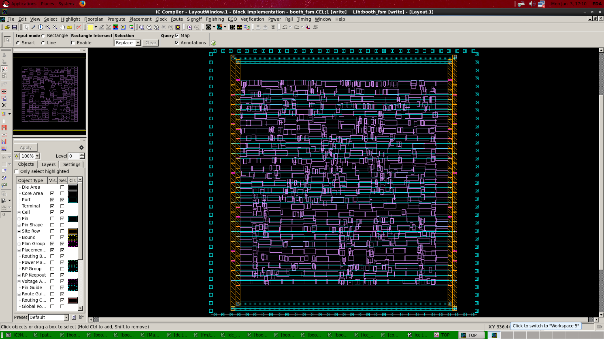

接下来进行布局优化，将元件放置于合适的位置，如下图所示

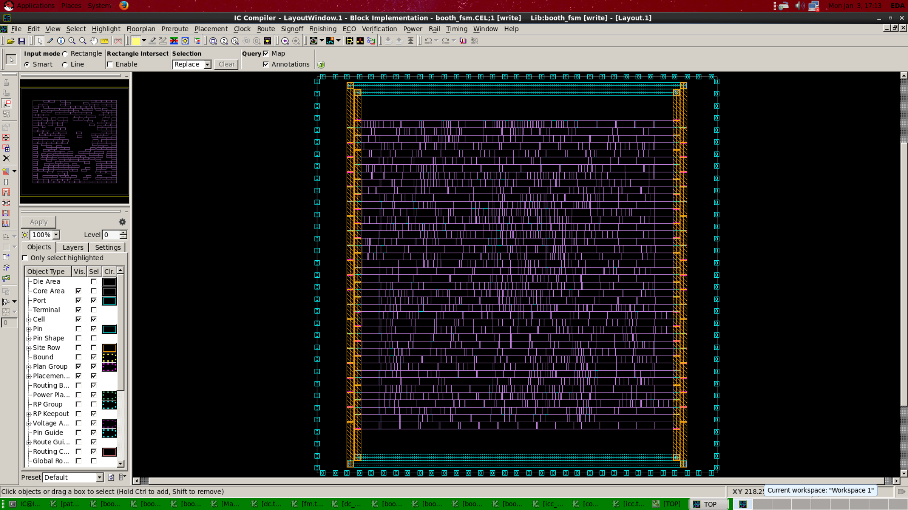

时钟树报告如下

```txt
****************************************
Report : clock tree
Design : booth_fsm
Version: L-2016.03-SP1
Date   : Mon Jan  3 17:12:07 2022
****************************************

Information: Float pin scale factor for the 'max' operating condition of scenario 'default' is set to 1.000 (CTS-375)

======================= Clock Tree Summary ========================
Clock                Sinks     CTBuffers ClkCells  Skew      LongestPath TotalDRC   BufferArea
-----------------------------------------------------------------------------------------------
clock_main           295       6         6         0.0263    0.3057      0            123.0768
1
```

#### 布线优化

布局完成之后，要进行布线，并进行`hold_up time`修复，命令如下：

```tcl
remove_clock_latency clock_main
remove_ideal_network [all_fanout -flat -clock_tree]
set_propagated_clock clock_main 
set_clock_uncertainty -setup 0.01 clock_main
set_clock_uncertainty -hold 0.005 clock_main
set_fix_hold [all_clocks]
clock_opt -fix_hold_all_clocks -no_clock_route
derive_pg_connection -power_net {VDD} -power_pin {VDD} -ground_net {VSS} -ground_pin {VSS}
derive_pg_connection -power_net {VDD} -ground_net {VSS} -tie
route_zrt_auto
report_constraint -all_violators
```

结果如下所示
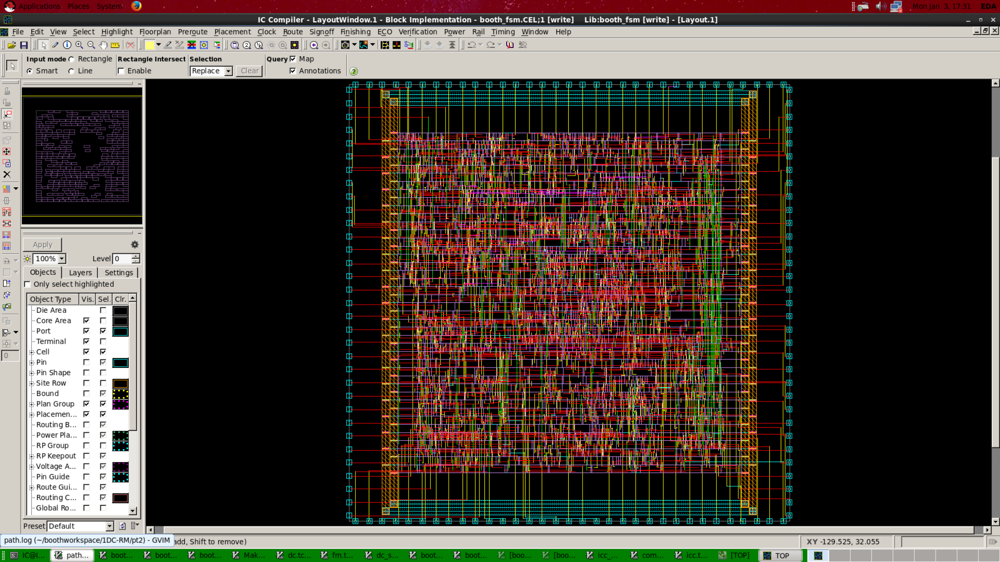

#### 优化后的violation检查

violation说明没有冲突。

```tcl
icc_shell> report_constraints -all_violators
```


```txt
****************************************
Report : constraint
        -all_violators
Design : booth_fsm
Version: L-2016.03-SP1
Date   : Mon Jan  3 17:30:20 2022
****************************************

        Parasitic source    : LPE
        Parasitic mode      : RealRC
        Extraction mode     : MIN_MAX
        Extraction derating : 25/25/25
This design has no violated constraints.

1
```

#### 优化后的LVS/DRC检查

通过ICC的LVS/DRC检查工具检查没有问题。

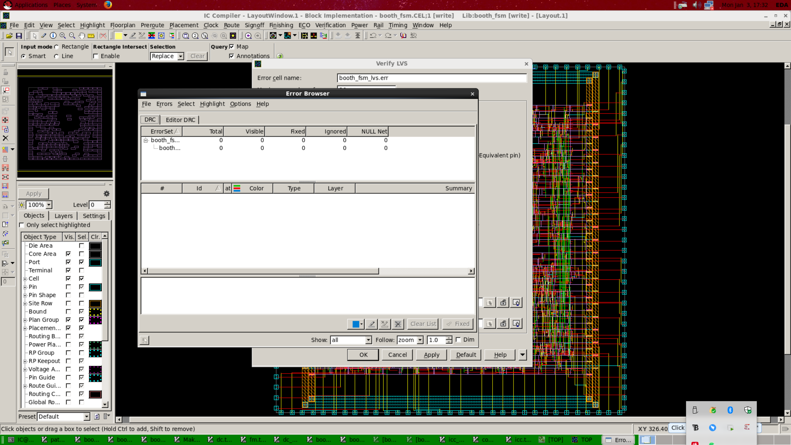

### 后仿

后仿使用VCS进行仿真，同样使用前仿的仿真脚本，即随机生成65535个testcase去计算；仿真结果如下

```txt
make[1]: Leaving directory `/home/IC/boothworkspace/1DC-RM/booth_vcs/csrc'
Chronologic VCS simulator copyright 1991-2014
Contains Synopsys proprietary information.
Compiler version I-2014.03_Full64; Runtime version I-2014.03_Full64;  Jan  3 17:47 2022
sim done. num good =       65535
$finish called from file "./boothmul_tb.v", line 71.
$finish at simulation time           8650642000
           V C S   S i m u l a t i o n   R e p o r t
```

## 总结

经过了前端和后端设计，最终我们完成了我们这个Booth乘法器的设计。

本设计在SMIC180nm工艺库下进行设计，并综合、布局、布线，最终完成这个booth乘法器，本booth乘法器采用状态机的方式进行计算，计算延时为66个cycles，面积和功耗均为要求的10%，虽然性能比较差，但是面积和功耗消耗非常小。